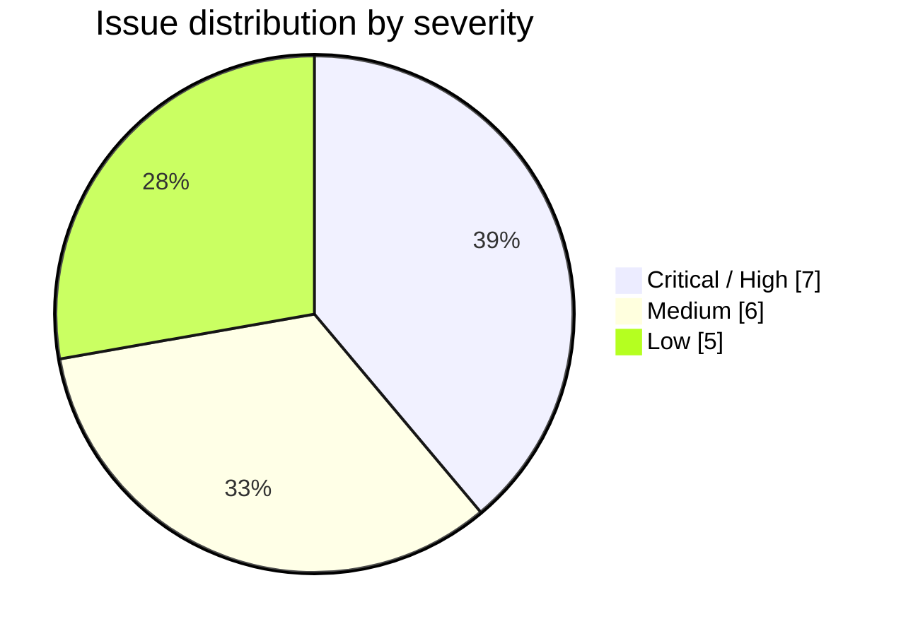
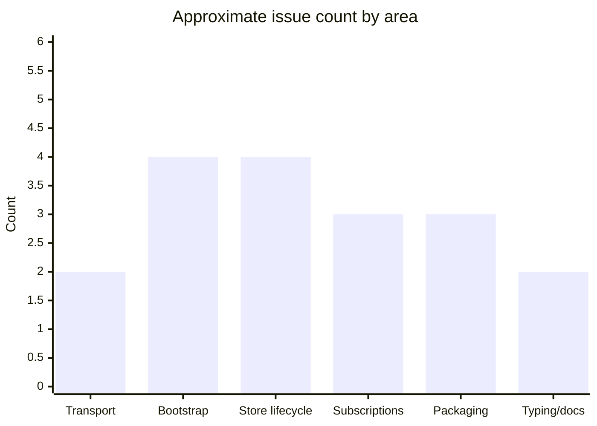
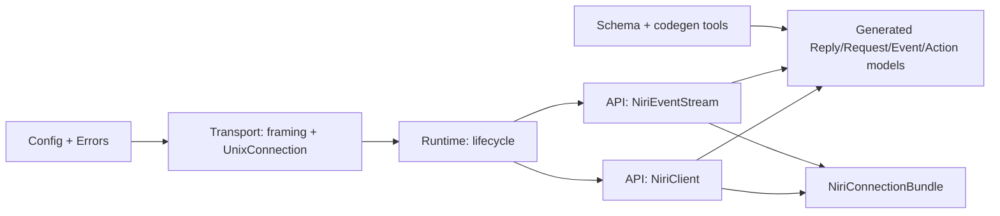
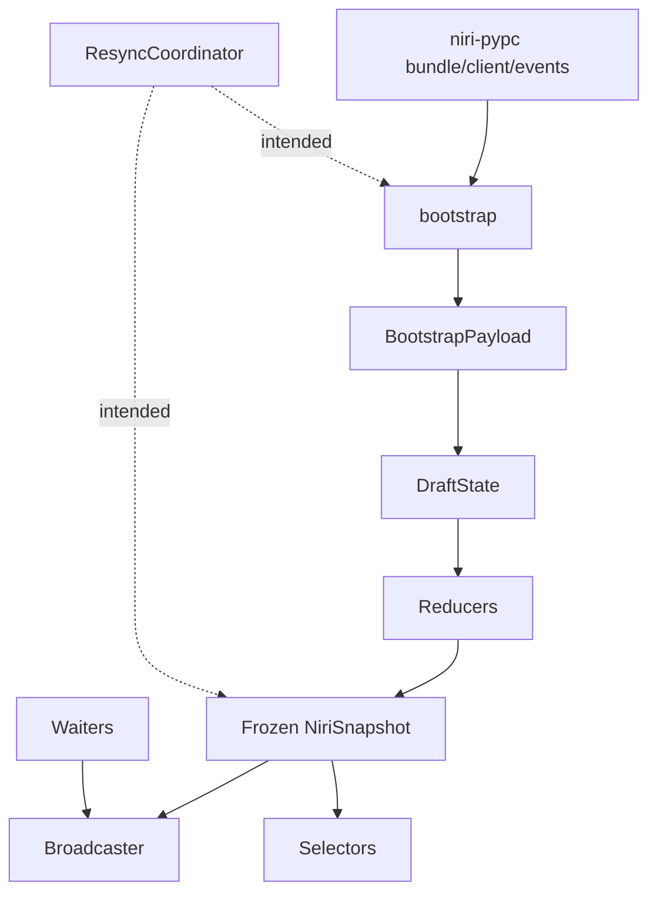

# Deep Research Report on `niri-state_v1` and `niri-pypc`

## Executive summary

Both repositories are thoughtfully structured and materially functional, but they are not equally mature.

`niri-pypc` is the stronger codebase today. It has a clean transport/runtime/API layering, generated protocol models pinned to an upstream schema version, good tests, and a clear error taxonomy. Its main correctness flaw is significant: the advertised `max_frame_size` is not actually honored for frames above asyncio’s default stream limit, so large replies or events can fail with `LimitOverrunError` long before the configured 4 MiB limit is reached (`niri-pypc/src/niri_pypc/config.py:22-28`, `niri-pypc/src/niri_pypc/api/client.py:48-69`, `niri-pypc/src/niri_pypc/api/event_stream.py:75-93`, `niri-pypc/src/niri_pypc/transport/connection.py:30-41`, `82-142`). I reproduced this locally with a 70 KB mock reply.

`niri-state_v1` has a promising architecture—immutable snapshots, mutable drafts for reducers, selector helpers, bootstrap replay, and a decoupled broadcaster—but it currently has several runtime correctness issues that make it unsafe to treat as production-ready without fixes. The most important are: revision numbers reset on refresh, auto-resync policy is effectively dead code, bootstrap can return `LIVE` even when the event stream fails during bootstrap, unknown events during bootstrap are recorded but their `STALE` health is overwritten back to `LIVE`, subscribers do not receive the initial snapshot, and broadcaster shutdown can hang subscribers waiting on `queue.get()` (`niri-state_v1/src/niri_state/_runtime/store.py:52-63`, `153-181`, `183-205`; `niri-state_v1/src/niri_state/_runtime/bootstrap.py:50-124`, `127-138`; `niri-state_v1/src/niri_state/_runtime/broadcaster.py:20-71`; `niri-state_v1/src/niri_state/_core/reducers/root.py:234-278`; `niri-state_v1/src/niri_state/_core/models/health.py:17-37`). I reproduced each of those behaviors locally with small targeted probes.

The integration story is conceptually sound—`niri-state_v1` uses `niri-pypc` models and event stream abstractions consistently—but packaging and compatibility are under-specified. `niri-state_v1` depends on plain `"niri-pypc"` with no version range, even though it imports internal generated types directly, and its local development setup depends on a sibling path `.context/niri-pypc` that is not included in the repository archive (`niri-state_v1/pyproject.toml:11-21`, `niri-state_v1/src/niri_state/_core/models/entities.py:3-8`, `niri-state_v1/src/niri_state/_runtime/bootstrap.py:7-29`, `niri-state_v1/src/niri_state/_core/reducers/*.py`).

The short version:

- `niri-pypc`: **good foundation, one high-priority transport bug, several packaging/typing improvements**
- `niri-state_v1`: **promising design, but multiple high-severity runtime bugs and API/usability gaps**
- Recommended release posture:
  - `niri-pypc`: fix transport limit bug, tighten packaging/CI, then release candidate
  - `niri-state_v1`: do not release as stable until the refresh/bootstrap/subscription issues are fixed and retested end-to-end

## Scope, execution results, and repository status

I extracted both repositories locally and reviewed source, tests, configuration, schemas, and packaging metadata directly from the archives. The primary evidence base was the repositories’ own source files and tests.

### Local execution status

| Repository | Test result | Notes |
|---|---:|---|
| `niri-pypc` | All collected tests passed; 3 live tests skipped | Live tests are gated on `NIRI_SOCKET` (`niri-pypc/tests/live/test_live.py:16-19`) |
| `niri-state_v1` | All collected tests passed when `niri-pypc` was added to `PYTHONPATH`; 3 live/integration tests skipped | Running `pytest` inside `niri-state_v1` alone failed import collection because `niri_pypc` was not importable without local path wiring (`niri-state_v1/pyproject.toml:19-21`) |
| `niri-pypc` static/runtime sanity | `compileall` passed; generated-code verification passed | `tools/verify_generated.py` reported generated code up to date |
| `niri-state_v1` static/runtime sanity | `compileall` passed | Declared mypy/ruff were configured but not available offline in the execution environment (`niri-state_v1/pyproject.toml:27-68`) |

### Coverage signal from repository test runs

The absolute pass rate is good, but the coverage distribution shows important blind spots.

- `niri-pypc`’s coverage is good overall, but gaps remain in `api/event_stream.py`, `transport/connection.py`, and the generated model edge paths.
- `niri-state_v1`’s overall coverage is much weaker in the highest-risk areas: reducers, store lifecycle, resync orchestration, and aggregate selectors. In particular, `store.py`, `root.py`, `windows.py`, `workspaces.py`, and `resync.py` are under-covered relative to their operational importance.





## Architecture and integration assessment

The macro-architecture is good in both repos. The problem is not conceptual direction; it is operational completion.

### `niri-pypc` architecture

`niri-pypc` follows a clean layered design:



This is a strong separation of concerns:

- configuration and socket discovery are isolated (`niri-pypc/src/niri_pypc/config.py:1-41`)
- framing is isolated from socket transport (`niri-pypc/src/niri_pypc/transport/framing.py:1-33`)
- lifecycle is encapsulated (`niri-pypc/src/niri_pypc/runtime/lifecycle.py:11-91`)
- public APIs are thin wrappers over transport and models (`niri-pypc/src/niri_pypc/api/client.py:17-85`, `event_stream.py:50-282`, `bundle.py:12-70`)

This is the main reason the repository tests well and will be easy to maintain.

### `niri-state_v1` architecture

`niri-state_v1` also has a solid shape:



The strong ideas are:

- immutable published snapshots via `NiriSnapshot` (`niri-state_v1/src/niri_state/_core/models/snapshot.py:35-73`)
- mutable reducer workspace via `DraftState` (`niri-state_v1/src/niri_state/_core/models/draft.py:27-129`)
- domain reducers split by concern (`_core/reducers/*.py`)
- explicit invariants (`niri-state_v1/src/niri_state/_core/invariants.py:6-112`)
- selector-only read APIs (`niri-state_v1/src/niri_state/selectors/*.py`)

Those are the right primitives for a state engine.

The main architectural weakness is that the runtime layer is not fully wired together. `ResyncCoordinator` exists, but the main `NiriState` runtime never instantiates or uses it, so `AUTO` resync policy is currently non-functional in practice (`niri-state_v1/src/niri_state/_runtime/resync.py:11-72`; no meaningful usage from the rest of `src/`).

### Integration between the two repositories

The direct integration points are correct in principle:

- config interop via `NiriStateConfig.pypc: NiriConfig` (`niri-state_v1/src/niri_state/config.py:42-54`)
- bootstrap uses `NiriConnectionBundle`, request models, and reply models from `niri-pypc` (`niri-state_v1/src/niri_state/_runtime/bootstrap.py:7-29`)
- reducers consume generated event classes from `niri-pypc` (`niri-state_v1/src/niri_state/_core/reducers/root.py:3-28`)
- state entities embed protocol models from `niri-pypc` (`niri-state_v1/src/niri_state/_core/models/entities.py:3-39`)

But versioning and packaging do not reflect that tight coupling. `niri-state_v1` imports many generated/internal protocol classes directly yet declares only `niri-pypc` with no compatible range, which is too loose for a pre-1.0 dependency surface (`niri-state_v1/pyproject.toml:11-16`). This is a backward-compatibility risk.

## Detailed findings by severity and module

### Summary table

| Severity | Repo | Module / file | Finding | Impact | Effort |
|---|---|---|---|---|---|
| High | `niri-pypc` | `transport/connection.py`, `api/client.py`, `api/event_stream.py` | `max_frame_size` is not honored above asyncio’s default stream limit | Large replies/events can fail unexpectedly | S |
| High | `niri-state_v1` | `store.py` | `refresh()` resets revisions back to bootstrap revision 1 | Breaks monotonic ordering and downstream consumers | M |
| High | `niri-state_v1` | `store.py` | `refresh()` swaps snapshot/bundle before canceling old mutation loop | Race can apply stale events to fresh state | M |
| High | `niri-state_v1` | `broadcaster.py` | `close()` does not wake blocked subscribers | Shutdown can hang indefinitely | S |
| High | `niri-state_v1` | `bootstrap.py` | Bootstrap can return `LIVE` even if event stream fails during bootstrap | Silent desync at startup | M |
| High | `niri-state_v1` | `bootstrap.py` + `root.py` | Unknown events during bootstrap mark draft stale, then bootstrap overwrites health back to `LIVE` | Policy violation, false confidence | S |
| High | `niri-state_v1` | runtime integration | `AUTO` resync policy is effectively unused by `NiriState` | Config does not do what it advertises | M |
| Medium | `niri-state_v1` | public API | No top-level “start/open” API despite exporting `NiriState` | Hard to use correctly without private imports | M |
| Medium | `niri-state_v1` | `store.py`, `waiters.py`, `broadcaster.py` | Subscribers and watchers do not see the initial snapshot | First-state visibility is inconsistent | S |
| Medium | `niri-state_v1` | `health.py`, `store.py` | `LIVE -> RESYNCING` transition is illegal, so manual refresh silently skips resyncing state | State lifecycle observability is wrong | S |
| Medium | `niri-state_v1` | `draft.py`, `store.py` | Every applied event rebuilds full indexes and copies snapshot maps | Performance degrades with large window/workspace counts | M/L |
| Medium | both | packaging | No `LICENSE` file, no CI workflow, sparse project metadata | Publishing/compliance/discoverability risk | S |
| Medium | `niri-state_v1` | `pyproject.toml` | Dependency on `niri-pypc` is unpinned, dev path is external `.context/niri-pypc` | Fragile local setup and compatibility drift | S |
| Low | `niri-state_v1` | `selectors/aggregates.py` | `FocusedContext` types do not match actual `None`-producing behavior | Type/API inconsistency | S |
| Low | `niri-state_v1` | archive contents | `tests/**/__pycache__` files are present in the uploaded archive | Repository hygiene | S |
| Low | `niri-pypc` | `types/__init__.py` | Wildcard API export from generated types is broad and hard to stabilize | Noisy public namespace | M |
| Low | both | docs | README for `niri-state_v1` is effectively empty; `niri-pypc` docs are decent but incomplete on limits and lifecycle | Adoption friction | S |

### High severity findings

#### Transport frame-size bug in `niri-pypc`

`NiriConfig.max_frame_size` defaults to 4 MiB (`niri-pypc/src/niri_pypc/config.py:22-28`), and both client and event stream pass that into `read_frame()` (`niri-pypc/src/niri_pypc/api/client.py:63-66`, `api/event_stream.py:123-126`). But `UnixConnection.connect()` opens the stream with default `asyncio.open_unix_connection()` settings and does not set the stream `limit` (`niri-pypc/src/niri_pypc/transport/connection.py:30-41`). `read_frame()` then uses `StreamReader.readuntil(b"\n")` (`transport/connection.py:95-99`), which is constrained by asyncio’s stream limit, not by `max_frame_size`.

Result: replies larger than about 64 KiB can fail with `asyncio.LimitOverrunError` before your configured max frame size is reached. I reproduced this locally with a 70 KB mock reply.

This is both a correctness and reliability issue, and it directly affects `niri-state_v1` bootstrap, which makes requests for outputs/windows/workspaces that can become large.

#### Revision numbers reset during `niri-state_v1.refresh()`

`refresh()` does this today:

- runs bootstrap
- sets `self._current_snapshot = outcome.initial_snapshot`
- sets `self._revision = outcome.initial_snapshot.revision`

That snapshot revision is always bootstrap-local, currently `1` (`niri-state_v1/src/niri_state/_runtime/bootstrap.py:101-124`, `store.py:158-163`).

So a store at revision `5` can refresh back to revision `1`. I reproduced that locally.

This breaks a fundamental invariant for any streamed state system: revision numbers should be monotonic for the lifetime of the store, or else explicitly namespaced by epoch.

#### `refresh()` ordering introduces stale-event race

In `refresh()`, the old bundle and old mutation loop are canceled only after the new bundle and new snapshot have been assigned (`niri-state_v1/src/niri_state/_runtime/store.py:160-173`). That means the old mutation loop can still run briefly and apply events from the old event stream against the newly replaced snapshot state.

That race is subtle but real. It is exactly the kind of bug that becomes intermittent and expensive to debug in production.

#### Subscriber shutdown hang

`Broadcaster.subscribe()` creates an async iterator that blocks on `await subscriber.queue.get()` until an item is available (`niri-state_v1/src/niri_state/_runtime/broadcaster.py:27-44`). `Broadcaster.close()` only flips flags and clears the subscriber registry (`broadcaster.py:68-71`). It does not wake blocked consumers.

I reproduced this locally: a task awaiting `stream.__anext__()` remained blocked after `close()` until an external timeout fired.

This is a high-severity correctness issue because shutdown and task cleanup can hang indefinitely.

#### Bootstrap can report `LIVE` after event-stream failure

Bootstrap starts an event reader task while running snapshot queries (`niri-state_v1/src/niri_state/_runtime/bootstrap.py:58-67`). The reader loop swallows event-stream exceptions and just breaks (`bootstrap.py:127-138`). Then bootstrap proceeds to publish a `LIVE` snapshot (`bootstrap.py:101-124`).

I reproduced a case where the event stream closed during bootstrap and `run_bootstrap()` still returned `HealthState.LIVE`.

This defeats the whole point of concurrent event buffering during bootstrap: if the stream died before the replay window closed, the snapshot cannot be trusted as live.

#### Unknown bootstrap events are recorded and then effectively ignored

Unknown events under `UnknownEventPolicy.STALE` correctly mark the draft `STALE` in the root reducer (`niri-state_v1/src/niri_state/_core/reducers/root.py:245-256`). But after replaying buffered events, bootstrap always forces `draft.health = HealthState.LIVE` (`niri-state_v1/src/niri_state/_runtime/bootstrap.py:98-103`).

I reproduced this locally: a future/unknown event during bootstrap yielded a snapshot with `unknown_events_seen == 1` but final `health == LIVE`.

That is a direct policy violation. The system is detecting risk and then discarding the health consequence.

#### `AUTO` resync policy is not actually integrated

`ResyncCoordinator` exists and implements auto-resync logic (`niri-state_v1/src/niri_state/_runtime/resync.py:11-72`), but the runtime store never wires it in. A repository-wide search showed usage only in the resync module itself and its tests.

I also reproduced this behavior indirectly: configuring `ResyncPolicy.AUTO` and letting the event stream fail marked the store stale, but `refresh()` was never invoked.

This is an API-contract problem: the config advertises behavior that the main runtime does not provide.

### Medium severity findings

#### Public API is not self-starting

Top-level `niri_state.__init__` exports `NiriState`, configs, errors, and selectors, but not bootstrap helpers (`niri-state_v1/src/niri_state/__init__.py:3-57`). `NiriState.connect()` requires an `initial_snapshot` and `bundle` (`store.py:52-63`), which ordinary users cannot construct from the public API.

So the main exported class is not actually startable without private imports from `_runtime.bootstrap`.

That is a strong sign the public API boundary is not finished.

#### Initial snapshot delivery is inconsistent

`NiriState.subscribe()` delegates directly to the broadcaster (`store.py:149-151`). `connect()` does not broadcast the initial snapshot; only later updates are broadcast. Existing subscribers before `connect()` therefore do not receive the initial state, and new subscribers after `connect()` do not receive it unless they separately poll `state.snapshot`.

I reproduced that locally: subscribing after `connect()` and awaiting the first item timed out.

The wait helpers partially mask this because `wait_until()` checks `state.snapshot` first (`niri-state_v1/src/niri_state/_runtime/waiters.py:50-57`), but `watch()` does not have the same protection and its tests rely on a mock state that eagerly yields an initial item (`tests/runtime/test_waiters.py:29-43`, `95-116`).

#### Illegal `LIVE -> RESYNCING` transition

The health machine allows:

- `LIVE -> STALE`
- `LIVE -> CLOSED`

but not `LIVE -> RESYNCING` (`niri-state_v1/src/niri_state/_core/models/health.py:17-37`).

Yet `refresh()` explicitly calls `_transition_health(RESYNCING, "manual refresh")` (`store.py:153-158`). Because `_transition_health()` swallows invalid transitions by returning early (`store.py:124-129`), manual refresh from a healthy live state does not surface the resyncing lifecycle transition at all.

I reproduced that locally.

#### Full-copy immutable snapshot strategy is simple but expensive

Every applied event in the mutation loop creates a full `DraftState` from the current snapshot, applies one reducer, rebuilds all indexes, and freezes a new immutable snapshot (`niri-state_v1/src/niri_state/_runtime/store.py:79-108`, `_core/models/draft.py:62-129`).

That gives excellent functional clarity but poor scaling characteristics:

- full dict copies
- full index rebuilds
- tuple sorting in `build_indexes()`

This is acceptable for small-to-moderate compositor state sizes, but it will become a bottleneck under high event rates or large window/workspace sets.

### Low severity findings

#### Typing inconsistencies in aggregate selectors

`FocusedContext` declares several optional keys whose values are typed as concrete `WorkspaceState` / `WindowState` (`niri-state_v1/src/niri_state/selectors/aggregates.py:15-22`), but `get_focused_context()` assigns `.get(...)` results that may be `None` (`aggregates.py:50-60`). The runtime behavior is more nullable than the type contract.

#### Wildcard re-export in `niri-pypc.types`

`niri-pypc/types/__init__.py` re-exports generated types with `from ...generated import *` (`niri-pypc/src/niri_pypc/types/__init__.py:1-6`). This is convenient, but it makes the public namespace broad and potentially unstable across schema bumps.

#### Repository hygiene and metadata gaps

Both projects declare `license = { text = "MIT" }` in `pyproject.toml`, but neither includes a `LICENSE` file in the archive (`niri-pypc/pyproject.toml:1-18`, `niri-state_v1/pyproject.toml:1-21`). Both also have `project.urls` commented out, and neither archive includes CI workflow files. `niri-state_v1` additionally arrived with committed `tests/**/__pycache__` entries in the archive.

## Concrete code changes, patches, and tests

The patches below are the highest-value changes to make first.

### Patch for `niri-pypc`: honor configured frame sizes

This is the highest-priority fix in `niri-pypc`.

```diff
diff --git a/src/niri_pypc/transport/connection.py b/src/niri_pypc/transport/connection.py
index 0000000..0000000 100644
--- a/src/niri_pypc/transport/connection.py
+++ b/src/niri_pypc/transport/connection.py
@@
-from niri_pypc.errors import NiriTimeoutError, ProtocolError, TransportError
+from niri_pypc.errors import NiriTimeoutError, ProtocolError, TransportError
+
+DEFAULT_STREAM_LIMIT = 64 * 1024
@@
     def __init__(
         self,
         reader: asyncio.StreamReader,
         writer: asyncio.StreamWriter,
         socket_path: Path,
+        *,
+        stream_limit: int = DEFAULT_STREAM_LIMIT,
     ) -> None:
         self._reader = reader
         self._writer = writer
         self._socket_path = socket_path
         self._closed = False
+        self._stream_limit = stream_limit
@@
     async def connect(
         cls,
         socket_path: Path,
         *,
         timeout: float = 5.0,
+        stream_limit: int | None = None,
     ) -> UnixConnection:
@@
-            reader, writer = await asyncio.wait_for(
-                asyncio.open_unix_connection(str(socket_path)),
+            limit = stream_limit if stream_limit is not None else DEFAULT_STREAM_LIMIT
+            reader, writer = await asyncio.wait_for(
+                asyncio.open_unix_connection(str(socket_path), limit=limit),
                 timeout=timeout,
             )
@@
-        return cls(reader, writer, socket_path)
+        return cls(reader, writer, socket_path, stream_limit=limit)
@@
         try:
             raw = await asyncio.wait_for(
                 self._reader.readuntil(b"\n"),
                 timeout=timeout,
             )
+        except asyncio.LimitOverrunError as exc:
+            self._closed = True
+            raise ProtocolError(
+                f"Frame exceeds maximum {max_size} bytes before delimiter",
+                operation="read_frame",
+                socket_path=str(self._socket_path),
+                cause=exc,
+            ) from exc
         except TimeoutError as exc:
             ...
```

```diff
diff --git a/src/niri_pypc/api/client.py b/src/niri_pypc/api/client.py
index 0000000..0000000 100644
--- a/src/niri_pypc/api/client.py
+++ b/src/niri_pypc/api/client.py
@@
         conn = await UnixConnection.connect(
             socket_path,
             timeout=self._config.connect_timeout,
+            stream_limit=max(self._config.max_frame_size + 1, 64 * 1024),
         )
```

```diff
diff --git a/src/niri_pypc/api/event_stream.py b/src/niri_pypc/api/event_stream.py
index 0000000..0000000 100644
--- a/src/niri_pypc/api/event_stream.py
+++ b/src/niri_pypc/api/event_stream.py
@@
         conn = await UnixConnection.connect(
             socket_path,
             timeout=config.connect_timeout,
+            stream_limit=max(config.max_frame_size + 1, 64 * 1024),
         )
```

Suggested tests:

```python
async def test_request_accepts_large_frame_within_max_size(self, mock_server):
    socket_path, ctrl = mock_server
    payload = "x" * 70000
    ctrl["response"] = json.dumps({"Ok": {"Version": payload}}).encode() + b"\n"

    config = NiriConfig(
        socket_path=socket_path,
        connect_timeout=5.0,
        request_timeout=5.0,
        max_frame_size=200000,
    )
    async with NiriClient.connect(config) as client:
        result = await client.request(VersionRequest())

    assert result.variant.payload == payload
```

```python
async def test_request_rejects_frame_over_max_size(self, mock_server):
    socket_path, ctrl = mock_server
    payload = "x" * 70000
    ctrl["response"] = json.dumps({"Ok": {"Version": payload}}).encode() + b"\n"

    config = NiriConfig(
        socket_path=socket_path,
        connect_timeout=5.0,
        request_timeout=5.0,
        max_frame_size=1024,
    )
    async with NiriClient.connect(config) as client:
        with pytest.raises(ProtocolError, match="Frame exceeds maximum"):
            await client.request(VersionRequest())
```

### Patch for `niri-state_v1`: wake subscribers on close and surface the current snapshot

This addresses both the shutdown hang and the missing initial-state delivery problem.

```diff
diff --git a/src/niri_state/_runtime/broadcaster.py b/src/niri_state/_runtime/broadcaster.py
index 0000000..0000000 100644
--- a/src/niri_state/_runtime/broadcaster.py
+++ b/src/niri_state/_runtime/broadcaster.py
@@
 from collections.abc import AsyncIterator
 from dataclasses import dataclass
+from typing import Final, cast
@@
+_CLOSE_SENTINEL: Final[object] = object()
+
 @dataclass(slots=True)
 class Subscriber:
     id: int
-    queue: asyncio.Queue[tuple[NiriSnapshot, ChangeSet | None]]
+    queue: asyncio.Queue[tuple[NiriSnapshot, ChangeSet | None] | object]
     cancelled: bool = False
@@
     def __init__(self, queue_size: int, overflow_policy: SubscriberOverflowPolicy) -> None:
         self._queue_size = queue_size
         self._overflow_policy = overflow_policy
         self._subscribers: dict[int, Subscriber] = {}
         self._next_subscriber_id = 0
+        self._closed = False
@@
     def subscribe(self) -> AsyncIterator[tuple[NiriSnapshot, ChangeSet | None]]:
+        if self._closed:
+            async def _empty() -> AsyncIterator[tuple[NiriSnapshot, ChangeSet | None]]:
+                if False:
+                    yield
+                return
+            return _empty()
+
         ...
         async def _iter() -> AsyncIterator[tuple[NiriSnapshot, ChangeSet | None]]:
             try:
-                while not subscriber.cancelled:
+                while True:
                     item = await subscriber.queue.get()
-                    yield item
+                    if item is _CLOSE_SENTINEL:
+                        break
+                    if subscriber.cancelled:
+                        break
+                    yield cast(tuple[NiriSnapshot, ChangeSet | None], item)
             finally:
                 self._subscribers.pop(subscriber_id, None)
@@
     async def close(self) -> None:
-        for subscriber in self._subscribers.values():
-            subscriber.cancelled = True
-        self._subscribers.clear()
+        if self._closed:
+            return
+        self._closed = True
+        for subscriber in list(self._subscribers.values()):
+            subscriber.cancelled = True
+            try:
+                subscriber.queue.put_nowait(_CLOSE_SENTINEL)
+            except asyncio.QueueFull:
+                try:
+                    subscriber.queue.get_nowait()
+                except asyncio.QueueEmpty:
+                    pass
+                try:
+                    subscriber.queue.put_nowait(_CLOSE_SENTINEL)
+                except asyncio.QueueFull:
+                    pass
+        self._subscribers.clear()
```

```diff
diff --git a/src/niri_state/_runtime/store.py b/src/niri_state/_runtime/store.py
index 0000000..0000000 100644
--- a/src/niri_state/_runtime/store.py
+++ b/src/niri_state/_runtime/store.py
@@
     async def connect(self, initial_snapshot: NiriSnapshot, bundle: NiriConnectionBundle) -> None:
         async with self._lifecycle_lock:
             ...
             self._current_snapshot = initial_snapshot
             self._revision = initial_snapshot.revision
             self._shutdown_event.clear()
+            await self._broadcast(initial_snapshot, None)
             self._mutation_task = asyncio.create_task(self._mutation_loop(bundle))
@@
     def subscribe(self) -> AsyncIterator[tuple[NiriSnapshot, ChangeSet | None]]:
-        return self._broadcaster.subscribe()
+        async def _iter() -> AsyncIterator[tuple[NiriSnapshot, ChangeSet | None]]:
+            snapshot = self._current_snapshot
+            if snapshot is not None:
+                yield (snapshot, None)
+            async for item in self._broadcaster.subscribe():
+                yield item
+        return _iter()
```

Suggested tests:

```python
async def test_close_wakes_waiting_subscribers() -> None:
    broadcaster = Broadcaster(queue_size=1, overflow_policy=SubscriberOverflowPolicy.DROP_OLDEST)
    stream = broadcaster.subscribe()

    waiter = asyncio.create_task(stream.__anext__())
    await asyncio.sleep(0)
    await broadcaster.close()

    with pytest.raises(StopAsyncIteration):
        await asyncio.wait_for(waiter, timeout=0.5)
```

```python
async def test_subscribe_yields_current_snapshot_after_connect() -> None:
    state = NiriState(NiriStateConfig())
    snapshot = make_minimal_snapshot(revision=3)
    await state.connect(snapshot, dummy_bundle)

    stream = state.subscribe()
    current, changeset = await asyncio.wait_for(stream.__anext__(), timeout=0.5)

    assert current.revision == 3
    assert changeset is None
```

### Patch for `niri-state_v1`: preserve monotonic revisions and fix refresh ordering

This is the most important store-level correctness change.

```diff
diff --git a/src/niri_state/_core/models/health.py b/src/niri_state/_core/models/health.py
index 0000000..0000000 100644
--- a/src/niri_state/_core/models/health.py
+++ b/src/niri_state/_core/models/health.py
@@
-    HealthState.LIVE: frozenset({HealthState.STALE, HealthState.CLOSED}),
+    HealthState.LIVE: frozenset({HealthState.STALE, HealthState.RESYNCING, HealthState.CLOSED}),
```

```diff
diff --git a/src/niri_state/_runtime/store.py b/src/niri_state/_runtime/store.py
index 0000000..0000000 100644
--- a/src/niri_state/_runtime/store.py
+++ b/src/niri_state/_runtime/store.py
@@
     async def refresh(self) -> None:
         from niri_state._runtime.bootstrap import run_bootstrap

         await self._transition_health(HealthState.RESYNCING, "manual refresh")

-        outcome = await run_bootstrap(self._config)
-
         old_bundle = self._bundle
-        self._bundle = outcome.bundle
-        self._current_snapshot = outcome.initial_snapshot
-        self._revision = outcome.initial_snapshot.revision
-
-        if self._mutation_task is not None:
-            self._mutation_task.cancel()
+        old_task = self._mutation_task
+        self._shutdown_event.set()
+        if old_task is not None:
+            old_task.cancel()
             try:
-                await self._mutation_task
+                await old_task
             except asyncio.CancelledError:
                 pass
+        self._mutation_task = None
+
+        outcome = await run_bootstrap(self._config)
+        next_revision = self._revision + 1
+        next_snapshot = outcome.initial_snapshot.model_copy(update={"revision": next_revision})
+        next_changeset = outcome.initial_changeset.model_copy(
+            update={"revision": next_revision, "timestamp": next_snapshot.timestamp}
+        )
+
+        self._bundle = outcome.bundle
+        self._current_snapshot = next_snapshot
+        self._revision = next_snapshot.revision

         self._shutdown_event.clear()
         self._mutation_task = asyncio.create_task(self._mutation_loop(outcome.bundle))
@@
-        await self._broadcast(outcome.initial_snapshot, outcome.initial_changeset)
+        await self._broadcast(next_snapshot, next_changeset)
```

Suggested tests:

```python
async def test_refresh_preserves_monotonic_revision() -> None:
    state = NiriState(NiriStateConfig())
    state._current_snapshot = make_minimal_snapshot(revision=5, health=HealthState.LIVE)
    state._revision = 5
    state._bundle = idle_bundle

    async def fake_run_bootstrap(config):
        snapshot = make_minimal_snapshot(revision=1, health=HealthState.LIVE)
        changeset = ChangeSet(
            revision=1,
            timestamp=snapshot.timestamp,
            cause=ChangeCause.BOOTSTRAP,
            changed_domains=frozenset(),
        )
        return BootstrapOutcome(bundle=idle_bundle, initial_snapshot=snapshot, initial_changeset=changeset)

    bootstrap_module.run_bootstrap = fake_run_bootstrap
    await state.refresh()

    assert state.snapshot is not None
    assert state.snapshot.revision > 5
```

### Recommended bootstrap patch

I would also change bootstrap semantics in two ways, even though this is slightly larger than the validated patches above:

- surface event reader failures that happen before bootstrap replay is complete
- preserve `STALE` if buffered replay sets it, instead of unconditionally forcing `LIVE`

Minimal intent:

```python
if reader_errors:
    raise BootstrapError("Event stream failed during bootstrap", cause=reader_errors[0])

...

if draft.health is HealthState.BOOTSTRAPPING:
    draft.health = HealthState.LIVE
```

Suggested tests:

- event stream closes before bootstrap completes -> bootstrap raises `BootstrapError`
- unknown event buffered during bootstrap under `STALE` policy -> initial snapshot health is `STALE`, not `LIVE`

## Packaging, documentation, typing, and CI recommendations

### Packaging and dependency management

These should be done in both repos before public release.

| Item | Recommendation | Evidence |
|---|---|---|
| Dependency pinning | In `niri-state_v1`, pin `niri-pypc` to a compatible range, e.g. `>=0.1.0,<0.2.0`, or exact-match if releases are tightly coupled | `niri-state_v1/pyproject.toml:11-16` |
| Local workspace setup | Replace `.context/niri-pypc` with a documented workspace or monorepo strategy, or remove that expectation from default dev config | `niri-state_v1/pyproject.toml:19-21` |
| License file | Add `LICENSE` to both repos | `pyproject.toml` claims MIT but archive lacks license files |
| Project metadata | Uncomment and populate `project.urls`, add classifiers, keywords, and maintainers | both `pyproject.toml` files |
| Build verification | Add a release job that builds wheel + sdist and installs them into a clean env before publishing | no CI workflows present |

Recommended `niri-state_v1` dependency stanza:

```toml
dependencies = [
  "pydantic>=2.12.5",
  "niri-pypc>=0.1.0,<0.2.0",
]
```

If the generated model surface is intentionally lockstep, use an exact pin instead.

### Documentation

`niri-pypc` README is reasonably good and matches the tested API surface (`README.md`, `tests/api/test_client.py`, `tests/api/test_event_stream.py`, `tests/api/test_bundle.py`). The one major thing it should document is the framing/size model and the fact that event streams are one persistent connection with bounded queue/backpressure.

`niri-state_v1` needs real documentation. Right now the README is effectively one sentence (`niri-state_v1/README.md:1`), which is not adequate for a state engine with lifecycle, selectors, broadcast semantics, and health modes.

I would add:

- startup example
- refresh/resync semantics
- subscriber semantics
- health state machine
- unknown-event policy behavior
- invariants and when they are enforced

Suggested public API doc shape:

```python
class NiriState:
    @classmethod
    async def start(cls, config: NiriStateConfig | None = None) -> "NiriState":
        """
        Bootstrap from the compositor, connect the event stream,
        publish the initial snapshot, and return a running store.
        """

    @property
    def snapshot(self) -> NiriSnapshot | None:
        """Latest immutable snapshot."""

    def subscribe(self) -> AsyncIterator[tuple[NiriSnapshot, ChangeSet | None]]:
        """
        Yield the current snapshot immediately, then future publications.
        Guaranteed to terminate cleanly on close().
        """

    async def refresh(self) -> None:
        """
        Perform a resync while preserving monotonic revisions.
        Emits RESYNCING -> LIVE or FAILED lifecycle changes.
        """
```

### Typing

The two repos currently use different type-checking strategies:

- `niri-pypc` declares `ty` and excludes generated code (`niri-pypc/pyproject.toml:72-82`)
- `niri-state_v1` declares strict mypy (`niri-state_v1/pyproject.toml:43-68`)

That mismatch increases friction across a tightly coupled pair of projects. I recommend standardizing on one checker for both repos. If you want broad adoption and predictable CI, mypy or pyright is a safer choice today than an alpha checker in one repo and mypy in the other.

I would also reduce `type: ignore` usage in `niri-state_v1` by introducing small helper constructors/updaters for protocol state updates instead of repeated inline `model_copy(update=...)` calls.

### CI

A minimal but strong CI matrix for both repos should include:

- Python 3.13 on Linux
- `pytest`
- `python -m compileall src tests`
- formatter/linter
- type checker
- package build smoke test

Suggested workflow stages:

```yaml
jobs:
  test:
    steps:
      - checkout
      - setup-python
      - install deps
      - run: pytest -q -ra
      - run: python -m compileall -q src tests

  lint:
    steps:
      - run: ruff check .
      - run: ruff format --check .

  typecheck:
    steps:
      - run: mypy .

  package:
    steps:
      - run: python -m build
      - run: python -m pip install dist/*.whl
      - run: python -c "import niri_pypc; import niri_state"
```

For `niri-pypc`, add a generated-code consistency job:

```yaml
- run: python tools/verify_generated.py
```

## Implementation plan, priorities, effort, and risk

### Recommended order

| Priority | Change | Repo | Effort | Risk | Why first |
|---|---|---|---|---|---|
| P0 | Fix stream-limit / frame-size bug | `niri-pypc` | 0.5 day | Low | Breaks large payloads and directly affects `niri-state_v1` bootstrap |
| P0 | Fix subscriber shutdown hang | `niri-state_v1` | 0.5 day | Low | Prevents stuck tasks and shutdown deadlocks |
| P0 | Fix refresh ordering + monotonic revisions | `niri-state_v1` | 1 day | Medium | Core correctness for long-lived runtime |
| P0 | Fix bootstrap event-stream failure handling | `niri-state_v1` | 1 day | Medium | Prevents false `LIVE` state at startup |
| P1 | Preserve `STALE` after unknown bootstrap events | `niri-state_v1` | 0.5 day | Low | Aligns behavior with policy contract |
| P1 | Wire `AUTO` resync into the main runtime | `niri-state_v1` | 1–1.5 days | Medium | Makes public config actually effective |
| P1 | Add `NiriState.start()` public constructor | `niri-state_v1` | 0.5–1 day | Low | Makes the library usable without private imports |
| P1 | Pin dependency compatibility range | `niri-state_v1` | 0.25 day | Low | Prevents release drift |
| P2 | Standardize type-checking approach | both | 0.5–1 day | Low | Improves CI signal |
| P2 | Expand README/API docs | both | 0.5–1 day | Low | Critical for adoption |
| P2 | Add CI workflows + package smoke tests | both | 0.5–1 day | Low | Prevents regression |
| P3 | Optimize snapshot rebuild strategy if needed | `niri-state_v1` | 2–4 days | Medium/High | Important only if event volume/state size warrants it |

### Risk assessment

- **Low-risk changes:** packaging metadata, LICENSE, CI, subscribe/close semantics, dependency pinning
- **Medium-risk changes:** bootstrap error policy, refresh ordering, auto-resync wiring
- **Higher-risk changes:** moving away from full-snapshot-copy publication or changing reducer/indexing strategy

My recommendation is to avoid large performance refactors until the lifecycle and correctness issues are fixed and covered by tests.

## Open questions and limitations

A few things remain intentionally conservative in this report:

- I could not run the declared external lint/type tools (`ruff`, `mypy`, `ty`) in the offline environment, so the static-analysis conclusions are based on repository configs, `compileall`, targeted runtime probes, and manual source review rather than those exact tool outputs.
- Live compositor tests were skipped because `NIRI_SOCKET` was not available.
- I did not treat generated protocol model internals as primary refactor targets unless they affected runtime/public API behavior; most of the important work is in transport/runtime layers around the generated code, not inside it.
- I did not recommend changing the one-connection-per-request command model in `niri-pypc`; it is clearly intentional (`README.md`, `api/client.py:17-22`) and should remain unless performance measurements justify a different protocol client mode.

Overall judgment:

- `niri-pypc`: **good and close**
- `niri-state_v1`: **architecturally promising, operationally incomplete**
- Best next step: fix the P0 items first, then add a public `NiriState.start()` path and an integration CI job that exercises both repos together in the same environment.