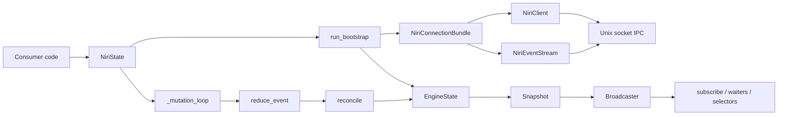
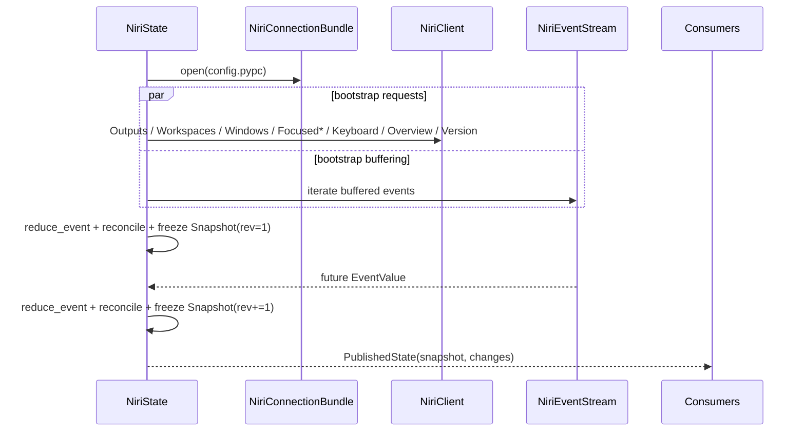

# Deep Review of niri-state and niri-pypc

## Executive summary

The attached `niri-pypc` repository is the stronger, more mature layer. Its architecture is cleanly separated into API, transport, lifecycle, and generated protocol types; its generated-type pipeline is well designed; its error taxonomy is coherent; and its test suite is large and meaningful. In a local run, it collected 184 tests, passed, skipped 14 environment-dependent nested/live tests, and reported 95% coverage. It also compiled cleanly under Python 3.13.5. (sources: `niri-pypc/pyproject.toml:1-107`, `niri-pypc/src/niri_pypc/__init__.py:1-43`, `niri-pypc/src/niri_pypc/api/client.py:48-135`, `niri-pypc/src/niri_pypc/api/event_stream.py:45-286`, `niri-pypc/src/niri_pypc/types/generated/_metadata.py:1-16`; validation: local `PYTHONPATH=src pytest -q -r s`, `python -m compileall -q`, 2026-05-13.)

The attached `niri-state` repository is promising but materially less finished. It has a good conceptual core—bootstrap, mutable engine state, deterministic reconciliation, immutable snapshots, and subscriber publication—but several correctness and API issues keep it from being “cleanest and most elegant” today. In a local run, it collected 29 tests, all passed, and reported 75% coverage, but the low coverage is concentrated in precisely the modules where correctness matters most: `store.py`, `reducers.py`, `broadcaster.py`, `waiters.py`, and most selector helpers. It also compiled cleanly under Python 3.13.5. (sources: `niri-state/pyproject.toml:1-91`, `niri-state/src/niri_state/store.py:36-372`, `niri-state/src/niri_state/bootstrap.py:37-206`; validation: local `PYTHONPATH=src:.../niri-pypc/src pytest -q`, `python -m compileall -q`, 2026-05-13.)

My bottom-line assessment is:

| Area | Assessment |
|---|---|
| `niri-pypc` architecture | Strong; good foundation |
| `niri-state` architecture | Sound core, but several lifecycle and contract gaps |
| Alignment with refactored `niri-pypc` | Partial, not full |
| Release readiness of `niri-state` | Not yet at “elegant/finalized” level |
| Highest-priority work | Fix lifecycle/resource bugs, correct API/docs mismatches, narrow the dependency boundary, implement or remove dead resync features |

The most important findings are these:

1. `niri-state`’s README example is currently wrong in two different ways: it calls `NiriState.start(...)` as if it were a classmethod, but `start()` is an instance method, and it iterates `subscribe()` as if it yielded `(snapshot, changeset)` tuples, while the actual API yields `PublishedState` objects. (sources: `niri-state/README.md:7-25`, `niri-state/src/niri_state/store.py:69-76`, `niri-state/src/niri_state/store.py:124-126`, `niri-state/src/niri_state/broadcaster.py:14-17`; validation: local repro produced `AttributeError: 'NiriStateConfig' object has no attribute 'connect'`, 2026-05-13.)

2. `refresh()` publishes the wrong change cause. A manual refresh defaults to `ChangeCause.REFRESH`, but the code emits `event_changeset(...)` instead of `refresh_changeset(...)`, so subscribers see `EVENT` instead of `REFRESH`. This is a concrete bug, not just a naming issue. (sources: `niri-state/src/niri_state/store.py:262-345`, especially `303-337`; `niri-state/src/niri_state/changes.py:67-76`; validation: local repro observed `pub2 cause event` after `refresh(cause=ChangeCause.REFRESH)`, 2026-05-13.)

3. `connect()` leaks resources if bootstrap fails, because `_bundle` is assigned before `run_bootstrap(...)` and there is no cleanup on exception. (source: `niri-state/src/niri_state/store.py:108-122`; validation: local repro left `state._bundle is bundle` and `bundle._closed == False` after a forced bootstrap failure, 2026-05-13.)

4. `refresh()` can leave the state engine inert if opening a new bundle fails, because the mutation loop is stopped before `_open_bundle()` is attempted and the code only restores the old loop in the `run_bootstrap(...)` failure path, not in the `new_bundle = await self._open_bundle()` failure path. (source: `niri-state/src/niri_state/store.py:275-286`; validation: local repro left `state._mutation_task is None` after a forced `_open_bundle()` failure, 2026-05-13.)

5. The state machine documents a `RESYNCING` health state, and the config exposes `resync_max_attempts` and `resync_backoff_base`, but none of these are actually implemented. `RESYNCING` is never entered anywhere in the code, and the retry/backoff fields are unused. (sources: `niri-state/README.md:35-39`, `niri-state/src/niri_state/config.py:48-50`, `niri-state/src/niri_state/health.py:8-52`, `niri-state/src/niri_state/resync.py:15-57`, `niri-state/src/niri_state/store.py:36-372`.)

6. `niri-state` is still too tightly coupled to `niri-pypc` internals. The refactored `niri-pypc` exposes a stable `niri_pypc.types` package, but `niri-state` imports directly from `niri_pypc.types.generated.*` and `niri_pypc.types.base`. That works today, but it is a brittle boundary for a dependent library. (sources: `niri-pypc/src/niri_pypc/types/__init__.py:1-11`, `niri-state/src/niri_state/protocol.py:3-54`.)

7. Versioning and packaging need cleanup: `niri-state`’s `pyproject.toml` says version `0.1.2`, while `src/niri_state/_version.py` says `0.1.0` and is not exposed by the package; `niri-pypc` ships stale checked-in distribution artifacts for version `0.2.0` even though the source version is `0.3.1`. (sources: `niri-state/pyproject.toml:1-6`, `niri-state/src/niri_state/_version.py:1-3`, `niri-pypc/pyproject.toml:1-6`; source inspection: `niri-pypc/dist/niri_pypc-0.2.0-py3-none-any.whl` metadata shows `Version: 0.2.0`.)

## Scope and validation method

I reviewed the attached source trees as the primary sources. I read the package metadata, readmes, public entry points, internal lifecycle/state modules, generated-type layers, representative tests, and local development configuration. I also executed what the sandbox allowed safely and reproducibly:

| Validation item | Result |
|---|---|
| Python runtime | Python 3.13.5 on Linux |
| Syntax validation | `compileall` passed for both repos |
| `niri-pypc` tests | 184 collected; pass; 14 skipped; 95% coverage |
| `niri-state` tests | 29 collected; all pass; 75% coverage |
| Live compositor tests | Not runnable here because no `niri` binary and no live `NIRI_SOCKET` |
| Ruff / mypy / ty | Not runnable here because those tools were not installed in the sandbox |
| Package build | Not runnable here because the build backend was unavailable offline |

Those constraints matter for interpretation. Test results are real. Lint/type/build findings below are partly simulated from the source, the configured tool settings, and targeted local reproductions using the provided fake bundle/client fixtures. (sources: `niri-pypc/pyproject.toml:25-107`, `niri-state/pyproject.toml:21-91`, `niri-pypc/devenv.nix:26-61`.)

## Current architecture and integration

At a high level, the two repositories fit together sensibly today.



`niri-pypc` exposes three connection-level abstractions: `NiriClient` for request/response calls, `NiriEventStream` for the persistent event stream, and `NiriConnectionBundle` as a convenience wrapper combining both. The protocol model layer is generated and strongly typed. That overall split is good. (sources: `niri-pypc/src/niri_pypc/__init__.py:9-24`, `niri-pypc/src/niri_pypc/api/client.py:48-135`, `niri-pypc/src/niri_pypc/api/event_stream.py:45-286`, `niri-pypc/src/niri_pypc/api/bundle.py:12-70`.)

`niri-state` then builds a separate state engine on top of that transport/client layer: bootstrap by polling a fixed request set, replay buffered events, run an event reduction loop, reconcile invariants/derived fields, and publish immutable `Snapshot` revisions. That is the right architectural choice. The state layer does not duplicate transport logic, and it treats `niri-pypc` types as the canonical wire/domain model. (sources: `niri-state/src/niri_state/bootstrap.py:48-206`, `niri-state/src/niri_state/store.py:36-372`, `niri-state/src/niri_state/engine_state.py:12-53`, `niri-state/src/niri_state/snapshot.py:14-92`.)

That said, the integration boundary is not yet minimal or future-proof:

| Integration surface | `niri-pypc` source of truth | `niri-state` usage | Assessment |
|---|---|---|---|
| Public connection API | `NiriConnectionBundle.open(config)` | `NiriState._open_bundle()` calls it directly | Good |
| Public type package | `niri_pypc.types` re-exports generated and base types | `niri-state.protocol` imports from deep generated modules | Fragile |
| Version response shape | `VersionResponse.payload: str` | `query_version()` still supports legacy object shapes | Legacy shim still present |
| Generated schema metadata | `_metadata.UPSTREAM_VERSION`, hashes | `Compatibility.schema_version` exists but is never filled | Missing alignment |
| Unknown event fallback | `UnknownEvent` sentinel included in `EventValue` | reducer supports policy, bootstrap mishandles it | Behavioral mismatch |

The cleanest long-term design is to make `niri-state` depend only on:

- `niri_pypc.NiriConnectionBundle`
- `niri_pypc.NiriConfig`
- `niri_pypc.types.*`
- `niri_pypc.types.generated._metadata` for compatibility/schema version reporting

and nothing deeper. Right now it is close, but not there yet. (sources: `niri-pypc/src/niri_pypc/config.py:19-42`, `niri-pypc/src/niri_pypc/types/__init__.py:1-11`, `niri-pypc/src/niri_pypc/types/generated/_metadata.py:6-16`, `niri-state/src/niri_state/config.py:37-65`, `niri-state/src/niri_state/protocol.py:3-54`.)



## Detailed findings

### Strengths

`niri-pypc` is thoughtfully structured. The generated-model system is explicit rather than heuristic, and the metadata-backed serde codec is the right abstraction for externally tagged enums. The `UnknownEvent` sentinel is a particularly good forward-compatibility decision. The lifecycle manager is also tight and easy to reason about. (sources: `niri-pypc/src/niri_pypc/types/base.py:13-99`, `niri-pypc/src/niri_pypc/types/codec.py:19-141`, `niri-pypc/src/niri_pypc/runtime/lifecycle.py:11-91`.)

`niri-state` also has several good design instincts. `EngineState` is mutable and internal; `Snapshot` is immutable and exposed; reconciliation is clearly separated from reduction; and the selector helpers are intentionally pure and side-effect free. That is exactly the right direction for a state-modeling library. (sources: `niri-state/src/niri_state/engine_state.py:12-53`, `niri-state/src/niri_state/snapshot.py:14-92`, `niri-state/src/niri_state/reconcile.py:11-74`, `niri-state/src/niri_state/selectors/*.py`.)

### High-severity correctness defects in niri-state

The most serious issue is resource/lifecycle correctness in `store.py`.

`connect()` currently assigns `self._bundle` before bootstrap and does not clean up if bootstrap fails. That creates a leaked bundle and leaves the instance in a partially initialized state. The simplest fix is to open into a local variable, bootstrap from that local variable, then assign to `self._bundle` only after success. (source: `niri-state/src/niri_state/store.py:108-122`.)

`refresh()` has a similar but subtler problem. It stops the mutation loop, then tries to open a new bundle, but it only restores the old loop when `run_bootstrap(new_bundle, ...)` fails. If `_open_bundle()` itself fails, the mutation loop stays dead. This is a real state-engine correctness bug. (source: `niri-state/src/niri_state/store.py:275-286`; validation: local forced `_open_bundle()` failure left `_mutation_task is None`, 2026-05-13.)

The second major issue is semantic drift between the documented health model and the implemented one. `HealthState.RESYNCING` exists in the enum and transition map, and the README documents it, but no code path ever transitions into it. The user-visible state machine is therefore overstated. Worse, the config exposes `resync_max_attempts` and `resync_backoff_base`, but the coordinator ignores them completely and simply loops on `Event.set()` and retries forever with no backoff, no logging, and no terminal diagnostics. (sources: `niri-state/src/niri_state/health.py:8-52`, `niri-state/src/niri_state/config.py:48-50`, `niri-state/src/niri_state/resync.py:23-48`, `niri-state/README.md:35-39`.)

The third major defect is in the bootstrap replay path. `run_bootstrap()` replays buffered events and calls `reduce_event(engine, event, ...)`, but it ignores the `ReduceResult`. That means `marked_desync=True` is discarded, so unknown-event or desync semantics are not applied correctly during bootstrap. The code then unconditionally sets `engine.health = HealthState.LIVE`, which is incompatible with the idea of a stale or desynced initial state. In a local repro using an `UnknownEvent`, I observed `health == LIVE` while `diagnostics.desynced == True`, which is internally inconsistent and confirms the bug empirically. (sources: `niri-state/src/niri_state/bootstrap.py:159-197`, especially `180-186`; `niri-state/src/niri_state/reducers.py:316-346`; validation: local repro observed `health live`, `desynced True`, 2026-05-13.)

The fourth major defect is change-cause misreporting. `refresh()` defaults to `ChangeCause.REFRESH`, but the publication branch uses `event_changeset(...)` whenever the cause is not `RESYNC`, so a normal refresh is surfaced as `EVENT`. This will confuse downstream consumers that depend on diffs or telemetry. (sources: `niri-state/src/niri_state/store.py:303-337`, `niri-state/src/niri_state/changes.py:55-88`; validation: local repro observed `ChangeCause.EVENT` after manual refresh, 2026-05-13.)

### Public API and documentation mismatches

The current `niri-state` public API is small, which is good, but its semantics are under-documented and partially misleading.

| API item | Actual code | README / implied contract | Assessment |
|---|---|---|---|
| `NiriState.start()` | Instance method returning `self` | Used as if classmethod | Incorrect docs |
| `subscribe()` | Yields `PublishedState` | Example unpacks `(snapshot, changeset)` | Incorrect docs |
| `health` | Method, not property | State object otherwise feels property-based | Naming inconsistency |
| `watch()` | Emits current snapshot and then subscribes | With `NiriState.subscribe()`, this duplicates the initial snapshot | Contract ambiguity |
| Current-snapshot semantics | `subscribe()` synthesizes `health_changeset(...)` for the initial yield | Not documented clearly | Semantically odd |

The README quick-start example needs correction immediately. The current snippet:

```python
state = await NiriState.start(NiriStateConfig())
async for snapshot, changeset in state.subscribe():
```

does not match the actual implementation. The minimal correct usage today is:

```python
state = await NiriState(NiriStateConfig()).start()
async for published in state.subscribe():
    print(published.snapshot.revision, published.snapshot.health, published.changes)
```

or, better, the library should add an async classmethod such as `NiriState.open(config)` and optionally an async context manager to support the more ergonomic style the README is clearly aiming for. (sources: `niri-state/README.md:7-25`, `niri-state/src/niri_state/store.py:36-126`, `niri-state/src/niri_state/broadcaster.py:14-17`.)

`watch()` also needs a contract decision. Right now it yields `state.snapshot` and then iterates `state.subscribe()`. Because `NiriState.subscribe()` already yields the current snapshot first, `watch()` duplicates that first item for real `NiriState` instances. I reproduced that locally. This is the kind of subtle API defect that creates flaky user code, especially in automation and “wait until” flows. (sources: `niri-state/src/niri_state/waiters.py:30-38`, `niri-state/src/niri_state/store.py:69-76`; validation: local repro yielded the same revision-1 snapshot twice, 2026-05-13.)

### Data models and type annotations

The core data-model story is mostly sound.

`niri-state` smartly reuses `niri-pypc`’s generated `Output`, `Workspace`, `Window`, `KeyboardLayouts`, `Overview`, and `Timestamp` models rather than wrapping or duplicating them. `Snapshot` then adds derived indexes like `workspaces_by_output`, `windows_by_workspace`, `active_workspace_by_output`, and `keyboard_current_name`. That is a clean separation of canonical state from derived convenience views. (sources: `niri-state/src/niri_state/protocol.py:24-54`, `niri-state/src/niri_state/snapshot.py:24-92`, `niri-pypc/src/niri_pypc/types/generated/models.py:293-372`.)

However, there are still several alignment gaps:

| Model area | Current state | Issue |
|---|---|---|
| Compatibility metadata | `Compatibility.schema_version` exists | Never populated |
| Runtime version handling | `VersionResponse.payload` is `str` in `niri-pypc` | `niri-state` still supports legacy object-shaped fallbacks |
| Snapshot index typing | `active_workspace_by_output` is typed as `MappingProxyType[str, int]` | It can insert `None` as a key if an active workspace lacks an output |
| Static typing distribution | `niri-pypc` ships `py.typed`; `niri-state` does not | Typed consumers cannot rely on PEP 561 typing for `niri-state` |

The missing `schema_version` population is more important than it may look. `niri-pypc` explicitly tracks upstream protocol provenance in `_metadata.py`, including `UPSTREAM_VERSION` and schema hashes, but `niri-state` only stores `Compatibility(niri_version=version)` and never records which protocol schema it was built against. That makes runtime diagnostics much less useful than they could be. (sources: `niri-pypc/src/niri_pypc/types/generated/_metadata.py:6-16`, `niri-state/src/niri_state/diagnostics.py:18-24`, `niri-state/src/niri_state/bootstrap.py:104-115`.)

On typing specifically, `niri-pypc` is PEP 561-compliant and includes targeted package metadata tests for its runtime version and `py.typed` marker, while `niri-state` has neither comparable typing packaging nor metadata tests. (sources: `niri-pypc/pyproject.toml:45-62`, `niri-pypc/src/niri_pypc/py.typed`, `niri-pypc/tests/test_package_metadata.py:12-23`, `niri-state/pyproject.toml:38-50`.)

One probable static-analysis issue is `niri-state`’s mypy configuration. It declares `packages = ["src/niri_state"]`, which is path-shaped, not package-shaped. If the project keeps mypy, this should likely become `packages = ["niri_state"]` or `files = ["src/niri_state"]`. I could not run mypy in this sandbox, so treat this as a likely configuration defect rather than a confirmed one. (source: `niri-state/pyproject.toml:61-72`.)

### Dependency injection, package structure, naming, and logging

`niri-state` currently tests its lifecycle by monkeypatching the private `_open_bundle()` method. That is a smell, because it means the production object has no public injection point for its transport boundary. A better design is to accept injected protocols for bundle creation, logging, and clock access. That would make tests cleaner and would also future-proof the `niri-pypc` integration boundary. Right now the tests are effective but rely on private-method substitution. (sources: `niri-state/src/niri_state/store.py:52-53`, `niri-state/tests/integration/test_refresh.py:16-21`, `niri-state/tests/integration/test_close_lifecycle.py:12-16`, `niri-state/tests/integration/test_desync_and_auto_resync.py:21-26`.)

The module layout in `niri-state` is readable for its size, but it does not clearly separate public API from internal machinery. `store.py`, `bootstrap.py`, `reducers.py`, `resync.py`, and `broadcaster.py` all live at the same package depth as public data/config modules. For long-term cleanliness, I would split the package into a clearly public surface and a clearly internal core, for example:

- `niri_state/api/` — `state.py`, `config.py`, `snapshot.py`, `selectors/`, `waiters.py`
- `niri_state/internal/` — `bootstrap.py`, `reducers.py`, `reconcile.py`, `resync.py`, `broadcaster.py`, `engine_state.py`, `diagnostics.py`

That change should be done with import shims for backward compatibility, but it would materially improve maintainability. (source: `niri-state/src/niri_state/` file layout.)

Naming also needs tightening. `protocol.py` is not really the protocol implementation; it is a re-export adapter. `store.py` contains the public `NiriState` and would be more naturally named `state.py`. `health()` should probably be a property for consistency with `snapshot`. And `start()` is sufficiently misleading that either `open()` should be added or `start()` should become a classmethod alias with the instance method renamed. (sources: `niri-state/src/niri_state/protocol.py:1-56`, `niri-state/src/niri_state/store.py:36-126`.)

Logging is almost absent in `niri-state`. `niri-pypc` at least logs a queue-overflow warning in the event stream reader, but `niri-state` silently swallows resync failures, silently mutates diagnostics, and emits no structured lifecycle logs. For a state engine, that is too little observability. The minimum logger events should be:

- bootstrap started / succeeded / failed
- mutation loop started / stopped
- desync detected
- auto-resync requested / started / failed / succeeded
- invariant violations found
- subscriber overflow encountered

Without those, production debugging will be unnecessarily hard. (sources: `niri-pypc/src/niri_pypc/api/event_stream.py:154-159`, `niri-state/src/niri_state/resync.py:43-48`, `niri-state/src/niri_state/store.py:176-182`, `216-255`.)

### Tests, CI, packaging, versioning, performance, and security

The test gap between the two repos is stark. `niri-pypc` has broad unit, integration, contract, generated-shape, metadata, transport, live, and nested test coverage. `niri-state` has a much smaller suite, and the low-coverage modules are exactly the ones where bugs were easiest to find by inspection and small local repros. That strongly suggests the current `niri-state` suite is validating the happy path but not enough failure, contract, and semantic behavior. (sources: `niri-pypc/tests/` tree, `niri-state/tests/` tree; validation: local pytest coverage output, 2026-05-13.)

Packaging is also notably stronger in `niri-pypc`. It includes `py.typed`, metadata tests, classifier metadata, and a generated-code verification toolchain. `niri-state` does not expose runtime versioning cleanly, does not ship `py.typed`, omits `LICENSE` from the sdist include list, and has no package-metadata tests. (sources: `niri-pypc/pyproject.toml:8-15`, `45-62`; `niri-state/pyproject.toml:42-50`; `niri-state/src/niri_state/_version.py:1-3`; `niri-pypc/tests/test_package_metadata.py:12-23`.)

There is no hosted CI workflow file in either repository. `niri-pypc` at least has a `devenv` CI script expressing intended checks, while `niri-state` does not even have that. (sources: repository top-level file listings, `niri-pypc/devenv.nix:47-57`, `niri-state/devenv.nix:1-56`.)

Performance-wise, the main hotspot in `niri-state` is snapshot freezing. Every published event creates a new `Snapshot`, and `Snapshot` copies the top-level `outputs`, `workspaces`, and `windows` dicts into `MappingProxyType(dict(value))`, making publication O(size of state) for every emitted revision. For normal compositor state sizes this may be fine, but this is the first place to benchmark if event rates become high. Bootstrap is also sequential today, issuing eight separate request calls one after another. Because `NiriClient.request()` is connection-per-request, the initial load/refresh latency will be higher than necessary and could likely be improved with `asyncio.gather(...)`. (sources: `niri-state/src/niri_state/snapshot.py:37-45`, `niri-state/src/niri_state/engine_state.py:38-53`, `niri-state/src/niri_state/bootstrap.py:96-129`, `niri-pypc/src/niri_pypc/api/client.py:103-122`.)

On security, the protocol-validation baseline is solid. `niri-pypc` validates decoded JSON through pydantic models, uses a typed error taxonomy, and truncates raw decode payload excerpts. `niri-state` itself adds little new attack surface. The main practical security/supply-chain concerns are looser version pinning and stale checked-in build artifacts. `niri-state` depends on `niri-pypc>=0.3.0`, but because it reaches into internals, that range is looser than it should be. Meanwhile `niri-pypc` contains checked-in `dist/` artifacts for `0.2.0` and a checked-in Rust `target/` directory under `tools/schema_exporter/target/`, both of which are repository hygiene problems and can lead to accidental confusion during releases. (sources: `niri-state/pyproject.toml:13-20`, repository listings under `niri-pypc/dist/` and `niri-pypc/tools/schema_exporter/target/`, `niri-pypc/src/niri_pypc/errors.py:35-50`.)

## Prioritized recommendations

The priority order below is the order I would implement, test, and release.

### Immediate recommendations

- Fix `niri-state` lifecycle/resource handling in `connect()`, `refresh()`, and `close()`. These are correctness bugs, not polish work. The highest-risk files are `src/niri_state/store.py` and `src/niri_state/bootstrap.py`. (sources: `niri-state/src/niri_state/store.py:95-122`, `262-372`, `niri-state/src/niri_state/bootstrap.py:159-206`.)
- Correct the README examples and either add `NiriState.open(...)` or document the real construction pattern. Also stop documenting tuple-unpacking from `subscribe()`. (sources: `niri-state/README.md:7-33`, `niri-state/src/niri_state/store.py:69-76`, `124-126`.)
- Replace deep `niri-pypc` imports with a stable adapter boundary using `niri_pypc.types` and `_metadata`. This is the single best alignment improvement with the refactored library. (sources: `niri-state/src/niri_state/protocol.py:3-54`, `niri-pypc/src/niri_pypc/types/__init__.py:1-11`.)
- Either implement `RESYNCING`, retry budget, and backoff properly, or remove them until they are real. Dead contract surface is worse than missing surface. (sources: `niri-state/src/niri_state/config.py:48-50`, `health.py:8-52`, `resync.py:15-57`.)
- Narrow the declared compatibility range to the version family you actually reviewed and tested, for example `niri-pypc>=0.3.1,<0.4`. (source: `niri-state/pyproject.toml:13-20`.)

### Near-term recommendations

- Add package metadata/version tests to `niri-state`, including a `py.typed` marker if the library is intended to be consumed as typed Python. Mirror the good pattern already present in `niri-pypc`. (sources: `niri-pypc/tests/test_package_metadata.py:12-23`.)
- Add failure-path tests for:
  - bootstrap failure closes bundle
  - refresh open-failure restarts old mutation loop
  - refresh publishes `ChangeCause.REFRESH`
  - bootstrap unknown event results in stale-or-failed initial state according to policy
  - `watch()` does not duplicate the initial snapshot
  - resync retry/backoff if implemented
- Add structured logging in `niri-state`.
- Remove stale build artifacts from `niri-pypc` and add ignore rules or CI checks preventing them from being reintroduced.

### Later recommendations

- Introduce explicit dependency injection hooks for bundle factory, logger, and clock.
- Reorganize `niri-state` into public vs internal modules with backward-compatible import shims.
- Benchmark `Snapshot` freeze cost under a synthetic high-event workload before considering more complex structural-sharing optimizations.
- Consider a single source of truth for type checking across both repos. Today `niri-pypc` is configured for `ty`, while `niri-state` is configured for mypy strict. A shared toolchain would reduce cognitive overhead. (sources: `niri-pypc/pyproject.toml:102-107`, `niri-state/pyproject.toml:61-72`.)

### Patch sketch for the most critical store.py fixes

```python
# src/niri_state/store.py

class NiriState:
    @classmethod
    async def open(cls, config: NiriStateConfig | None = None) -> "NiriState":
        state = cls(config)
        await state.connect()
        return state

    async def connect(self) -> None:
        async with self._lock:
            if self._closed:
                raise StateLifecycleError("state is already closed", operation="connect")
            if self._started:
                raise StateLifecycleError("state is already started", operation="connect")

            bundle = await self._open_bundle()
            try:
                outcome = await run_bootstrap(bundle, config=self._config)
            except Exception:
                await bundle.close()
                raise

            self._bundle = bundle
            self._install_bootstrap_outcome(outcome)
            await self._broadcaster.publish(
                PublishedState(
                    snapshot=outcome.initial_snapshot,
                    changes=outcome.initial_changeset,
                )
            )
            self._start_mutation_loop()
            await self._resync.start()
            self._started = True

    async def refresh(self, *, cause: ChangeCause = ChangeCause.REFRESH) -> Snapshot:
        async with self._lock:
            if self._bundle is None:
                raise StateLifecycleError("state is not connected", operation="refresh")
            if self._closed:
                raise StateLifecycleError("state is already closed", operation="refresh")

            old_bundle = self._bundle
            old_engine = self._engine

            await self._stop_mutation_loop()

            new_bundle: NiriConnectionBundle | None = None
            try:
                if old_engine is not None and old_engine.health in {HealthState.LIVE, HealthState.STALE}:
                    await self._transition_health(HealthState.RESYNCING)

                new_bundle = await self._open_bundle()
                outcome = await run_bootstrap(new_bundle, config=self._config)
            except Exception:
                if new_bundle is not None:
                    await new_bundle.close()
                self._bundle = old_bundle
                self._engine = old_engine
                self._start_mutation_loop()
                raise

            self._bundle = new_bundle
            self._engine = outcome.engine
            self._engine.diagnostics = with_resync(self._engine.diagnostics)

            if old_engine is not None:
                prev = old_engine.diagnostics
                self._engine.diagnostics = self._engine.diagnostics.model_copy(
                    update={
                        "event_count": prev.event_count + self._engine.diagnostics.event_count,
                        "resync_count": prev.resync_count + 1,
                    }
                )

            self._revision += 1
            self._snapshot = self._engine.freeze(revision=self._revision)

            await self._broadcaster.publish(
                PublishedState(
                    snapshot=self._snapshot,
                    changes=(
                        resync_changeset(revision=self._snapshot.revision, domains=_FULL_DOMAINS)
                        if cause is ChangeCause.RESYNC
                        else refresh_changeset(revision=self._snapshot.revision, domains=_FULL_DOMAINS)
                    ),
                )
            )

            self._start_mutation_loop()
            await old_bundle.close()
            return self._snapshot
```

That patch addresses the two highest-severity state-engine bugs and also restores the intended refresh cause semantics. It should be accompanied by regression tests. (sources: `niri-state/src/niri_state/store.py:95-122`, `262-345`, `niri-state/src/niri_state/changes.py:67-88`.)

### Patch sketch for bootstrap alignment with niri-pypc metadata and desync semantics

```python
# src/niri_state/bootstrap.py

from niri_pypc.types.generated._metadata import UPSTREAM_VERSION as PYPC_SCHEMA_VERSION

async def build_initial_engine_state(client: NiriClient) -> EngineState:
    outputs, workspaces, windows, focused_output, focused_window, keyboard_layouts, overview, version = await asyncio.gather(
        query_outputs(client),
        query_workspaces(client),
        query_windows(client),
        query_focused_output(client),
        query_focused_window(client),
        query_keyboard_layouts(client),
        query_overview(client),
        query_version(client),
    )

    engine = EngineState.empty()
    engine.outputs = dict(outputs)
    engine.workspaces = {workspace.id: workspace for workspace in workspaces}
    engine.windows = {window.id: window for window in windows}
    engine.keyboard_layouts = keyboard_layouts
    engine.overview = overview
    engine.health = HealthState.BOOTSTRAPPING
    engine.diagnostics = Diagnostics()
    engine.compatibility = Compatibility(
        niri_version=version,
        schema_version=PYPC_SCHEMA_VERSION,
        warnings=()
        if version in {None, PYPC_SCHEMA_VERSION}
        else (f"runtime niri version {version} differs from schema version {PYPC_SCHEMA_VERSION}",),
    )

    ...
    reconcile(engine)
    return engine

async def run_bootstrap(bundle: NiriConnectionBundle, *, config: NiriStateConfig) -> BootstrapOutcome:
    ...
    for event in buffered_events:
        result = reduce_event(engine, event, config=config, revision=0)
        if result.marked_desync:
            engine.health = HealthState.STALE
        reconcile(engine)

    if engine.health is HealthState.BOOTSTRAPPING:
        engine.health = HealthState.LIVE
```

This aligns the state layer with the refactored type metadata in `niri-pypc` and fixes the bootstrap desync semantic hole. (sources: `niri-state/src/niri_state/bootstrap.py:83-129`, `159-197`; `niri-pypc/src/niri_pypc/types/generated/_metadata.py:6-16`.)

## CI plan and migration checklist (**IGNORE**)

A clean CI design for these two repos should reflect their different roles.

For `niri-pypc`, the default CI pipeline should run:

- environment setup
- `python -m compileall -q src`
- `ruff check .`
- `ruff format --check .`
- `ty check .`
- `python tools/verify_generated.py --ir schema/ir/niri-ipc-ir.json --generated-dir src/niri_pypc/types/generated/`
- `pytest -q`
- package build
- an artifact sanity check that `dist/` is either generated fresh or absent from the repo

For `niri-state`, the default CI pipeline should run:

- environment setup with the reviewed `niri-pypc` source or wheel
- `python -m compileall -q src`
- `ruff check .`
- `ruff format --check .`
- type checking with one shared toolchain choice
- `pytest -q`
- package build
- package metadata smoke test: runtime version, importability, and `py.typed` if you add it

The optional environment-dependent jobs should be separate and clearly non-blocking unless release-specific:

- nested compositor integration tests
- live-socket tests
- prolonged event-stream soak tests

The migration checklist for full `niri-state` ↔ `niri-pypc` alignment is:

- [ ] Change `niri-state` imports to go through `niri_pypc.types` rather than deep generated modules. (sources: `niri-state/src/niri_state/protocol.py:3-54`, `niri-pypc/src/niri_pypc/types/__init__.py:1-11`.)
- [ ] Populate `Compatibility.schema_version` from `niri_pypc.types.generated._metadata.UPSTREAM_VERSION`. (sources: `niri-pypc/src/niri_pypc/types/generated/_metadata.py:6-16`, `niri-state/src/niri_state/diagnostics.py:18-24`.)
- [ ] Simplify `query_version()` to the refactored `VersionResponse.payload: str` contract, unless you explicitly want legacy compatibility. (sources: `niri-pypc/src/niri_pypc/types/generated/reply.py:73-76`, `niri-state/src/niri_state/bootstrap.py:83-93`.)
- [ ] Fix bootstrap desync handling so unknown events and unknown-entity event references behave consistently before revision 1. (sources: `niri-state/src/niri_state/bootstrap.py:180-186`, `niri-state/src/niri_state/reducers.py:316-346`.)
- [ ] Implement or remove `RESYNCING`, `resync_max_attempts`, and `resync_backoff_base`. (sources: `niri-state/src/niri_state/config.py:48-50`, `health.py:8-52`, `resync.py:15-57`.)
- [ ] Narrow the dependency range to the exact reviewed `niri-pypc` minor series. (source: `niri-state/pyproject.toml:13-20`.)
- [ ] Add regression tests for all lifecycle-failure paths in `store.py`. (source: `niri-state/src/niri_state/store.py:95-372`.)
- [ ] Correct the README and add a short API reference section that explicitly documents `PublishedState`, subscription semantics, refresh semantics, and selector usage. (source: `niri-state/README.md:1-47`.)
- [ ] Add package metadata/version tests and `py.typed` if typed distribution is intended. (sources: `niri-pypc/tests/test_package_metadata.py:12-23`, `niri-state/src/niri_state/_version.py:1-3`.)
- [ ] Remove stale checked-in build artifacts from `niri-pypc` and prevent reintroduction in CI. (source inspection: `niri-pypc/dist/`, `niri-pypc/tools/schema_exporter/target/`.)

If you make only five changes before the next release, make them these: fix `connect()` cleanup, fix `refresh()` recovery, fix refresh cause publication, implement or remove dead resync contract surface, and replace deep `niri-pypc` imports with a single stable adapter layer. Those five changes would eliminate most of the architectural and operational debt exposed by this review.